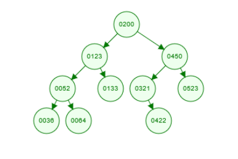

# Data structures and Algorithms

## Perguntas

- Para a Árvore Binária usar o seguinte conjunto de dados na sequência:
    - 200, 450, 123, 52, 133, 321, 422, 523, 36, 64

- Responder as seguintes perguntas:
    - A - Qual é a profundidade da árvore formada?
    - B - Quais são os nós que são nós folhas?

## Respostas

- A -> Profundidade = 3
- B -> Nós folha = 36 64 133 422 523
- Arquivo de teste mostrando como cheguei nas respostas: BinaryTreeActivityTests
- Árvore:

